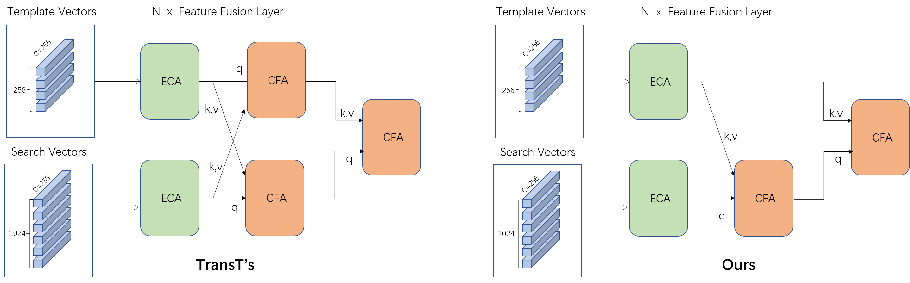

# Heterologous Image Matching

This is the course design of *Pattern Recognition and Machine Learning* in Huazhong University of Science and Technology, School of Artificial Intelligence and Automation

## Introduction
[TransT](https://github.com/chenxin-dlut/TransT) presents an attention-based network to achieve precise and robust detection and tracking by fusing template and search features. Inspired by TransT, we propose a pseudo-Siamese network that is independent at the lower level and shared at the higher level based on the characteristics of heterogeneous image-matching tasks. In the experiment, we discuss different backbones as well as different strategies of feature extraction for template and search images. Besides, we simplify the attention module in TransT according to the characteristics of image matching.

## Quick Start

### Train
To run a model, run
```
python run_train.py
```

### Evaluation
To get the test metrics, run
```
python run_test.py
```

### Demo
To see a demo, run
```
python demo.py
```


## Experiment result
### Dataset: [M3FD](https://github.com/JinyuanLiu-CV/TarDAL)
M3FD is a paired visible and infrared images dataset which contains 6 kinds of targets: {People, Car, Bus, Motorcycle, Lamp, Truck}.

### Backbone Processing Strategy

The following is the results of applying different backbone processing strategies to TransT on the M3FD test set.

|<sub>Backbone processing strategy</sub> | <sub>single backbone</sub> | <sub>low-sep-high-sharing double backbones</sub> | <sub>independent double backbones</sub>|
| :-: | :-: | :-: | :-: |
| <sub> Model parameters </sub> | <sub>**23.0M** </sub> | <sub>23.2M</sub> | <sub>31.6M<sub> | 
| <sub> FLOPs </sub> | <sub> **25.49G**</sub> | <sub> **25.49G**</sub> | <sub> **25.49G**</sub> |
| <sub> mIOU </sub> | <sub>0.71</sub> | <sub>**0.80**</sub>  | <sub>**0.80**</sub> |
| <sub> P0.5 </sub> | <sub>86.26%</sub> | <sub>**95.10%**</sub>  | <sub>92.91%</sub> |
| <sub> P0.7 </sub> | <sub>70.35%</sub> | <sub>**88.79%**</sub>  | <sub>86.95%</sub> |

(P0.5,P0.7 represents the ratio of IOU above 0.5,0.7 respectively)

###Different Backbones
The following is the results of applying the low-sep-high-sharing backbone processing strategies to model whose backbone is different from TranSt on the M3FD test set.

|<sub>Backbone Network</sub> | <sub>ResNet50</sub> | <sub>MobileNetv3</sub> | <sub>CSPNet</sub>|
| :-: | :-: | :-: | :-: |
| <sub> Model parameters </sub> | <sub>23.2M </sub> | <sub>**17.4M**</sub> | <sub>26.7M<sub> | 
| <sub> FLOPs </sub> | <sub> 25.49G</sub> | <sub> **15.34G**</sub> | <sub> 29.42G</sub> |
| <sub> mIOU </sub> | <sub>0.80</sub> | <sub>**0.81**</sub>  | <sub>0.77</sub> |
| <sub> P0.5 </sub> | <sub>95.10%</sub> | <sub>**96.66%**</sub>  | <sub>91.78%</sub> |
| <sub> P0.7 </sub> | <sub>**88.79%**</sub> | <sub>88.63%</sub>  | <sub>84.09%</sub> |

Appling the technology of multi-scale feature map fusion to above backbone.

|<sub>Backbone Network</sub> | <sub>ResNet50(multi)</sub> | <sub>MobileNetv3(multi)</sub> | <sub>CSPNet(multi)</sub>|
| :-: | :-: | :-: | :-: |
| <sub> Model parameters </sub> | <sub>24.3M </sub> | <sub>**17.9M**</sub> | <sub>27.6M<sub> | 
| <sub> FLOPs </sub> | <sub> 26.16G</sub> | <sub> **15.64G**</sub> | <sub> 29.98G</sub> |
| <sub> mIOU </sub> | <sub>0.80</sub> | <sub>**0.81**</sub>  | <sub>**0.81**</sub> |
| <sub> P0.5 </sub> | <sub>94.75%</sub> | <sub>**96.33%**</sub>  | <sub>93.91%</sub> |
| <sub> P0.7 </sub> | <sub>86.05%</sub> | <sub>88.43%</sub>  | <sub>**88.84%**</sub> |

We conduct experiments on homologous image matching based on M3FD's Visible image part.Note that it is now a Siamese network.

|<sub>Backbone Network</sub> | <sub>ResNet50</sub> | <sub>MobileNetv3(multi)</sub> | <sub>CSPNet(multi)</sub>|
| :-: | :-: | :-: | :-: |
| <sub> Model parameters </sub> | <sub>23.0M </sub> | <sub>**17.7M**</sub> | <sub>27.0M<sub> | 
| <sub> FLOPs </sub> | <sub> 25.49G</sub> | <sub> **15.64G**</sub> | <sub> 29.98G</sub> |
| <sub> mIOU </sub> | <sub>**0.92**</sub> | <sub>0.89</sub>  | <sub>0.91</sub> |
| <sub> P0.5 </sub> | <sub>99.25%</sub> | <sub>99.20%</sub>  | <sub>**99.61%**</sub> |
| <sub> P0.7 </sub> | <sub>96.61%</sub> | <sub>**97.75%**</sub>  | <sub>95.86%</sub> |

We apply the above model to the **COCO** dataset without fine-tuning.

|<sub>Backbone Network</sub> | <sub>ResNet50</sub> | <sub>MobileNetv3(multi)</sub> | <sub>CSPNet(multi)</sub>|
| :-: | :-: | :-: | :-: |
| <sub> mIOU </sub> | <sub>**0.85**</sub> | <sub>0.81</sub>  | <sub>0.84</sub> |
| <sub> P0.5 </sub> | <sub>**95.36%**</sub> | <sub>94.33%</sub>  | <sub>94.81%</sub> |
| <sub> P0.7 </sub> | <sub>**87.25%**</sub> | <sub>82.75%</sub>  | <sub>86.12%</sub> |

### Experiments on Attention Modules
<div align="center">
  
</div>

The following is the results of applying TransT's and ours attention module on the M3FD test set.

|<sub>Attention Module</sub> | <sub>TransT(x4)</sub> | <sub>Ours(x5)</sub> |
| :-: | :-: | :-: |
| <sub> Model parameters </sub> | <sub>23.2M </sub> | <sub>**19.8M**</sub> |
| <sub> FLOPs </sub> | <sub> **25.49G**</sub> | <sub> **25.49G**</sub> | 
| <sub> mIOU </sub> | <sub>0.80</sub> | <sub>**0.83**</sub>  |
| <sub> P0.5 </sub> | <sub>**99.25%**</sub> | <sub>99.20%</sub>|
| <sub> P0.7 </sub> | <sub>96.61%</sub> | <sub>**97.75%**</sub>|

(x4,x5 represents the number of layers stacked)


## Reference
```
@inproceedings{TransT,
title={Transformer Tracking},
author={Chen, Xin and Yan, Bin and Zhu, Jiawen and Wang, Dong and Yang, Xiaoyun and Lu, Huchuan},
booktitle={CVPR},
year={2021}
}

@inproceedings{TarDAL,
  title={Target-aware Dual Adversarial Learning and a Multi-scenario Multi-Modality Benchmark to Fuse Infrared and Visible for Object Detection},
  author={Jinyuan Liu, Xin Fan*, Zhangbo Huang, Guanyao Wu, Risheng Liu , Wei Zhong, Zhongxuan Luo},
  booktitle={Proceedings of the IEEE Conference on Computer Vision and Pattern Recognition},
  year={2022}
}
```
